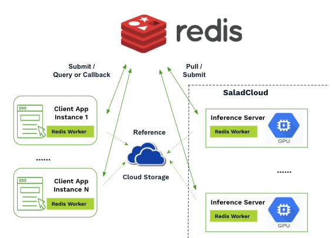

# Real-Time Queue on SaladCloud

This repository provides resources to build a custom real-time queue for applications on SaladCloud.

It supports the following use cases:

- Real-time AI inference for tasks like LLMs, transcription, image generation, and more.
- Node-to-node communication within the same container group or across different groups.
- Performance and resource monitoring for SCE workloads.

Several customers have successfully implemented similar solutions on SaladCloud, demonstrating the following advantages:

- Supports both asynchronous and synchronous calls, with results provided in streaming or non-streaming modes.
- Enables regional deployment to ensure local access and minimize latency.
- More resilient to burst traffic, node failures, and the variability in AI inference times.
- Flexible, customizable, and platform-independent.

Please refer to [this guide] (https://docs.salad.com/guides/real-time-inference/build-redis-queue) for more details.
